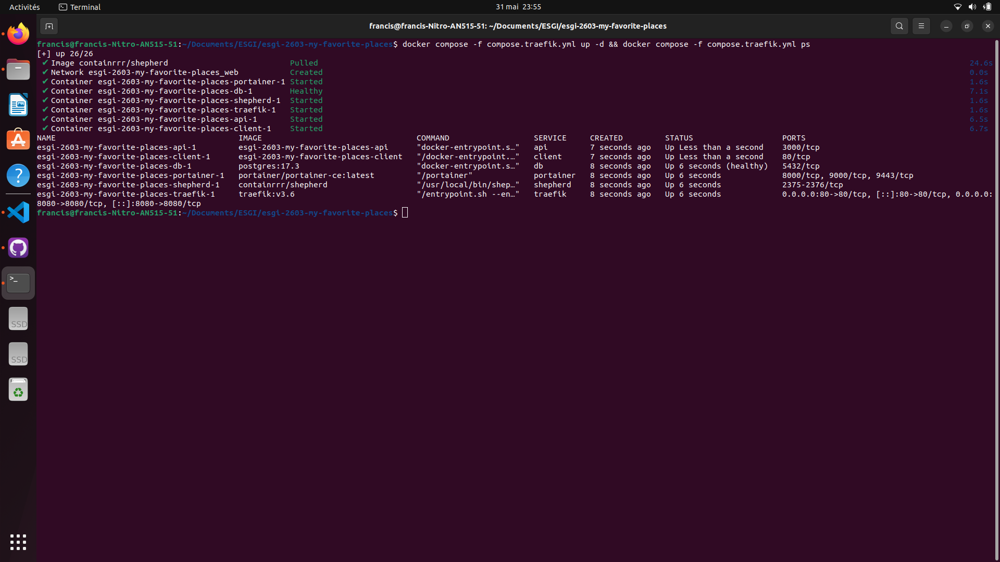
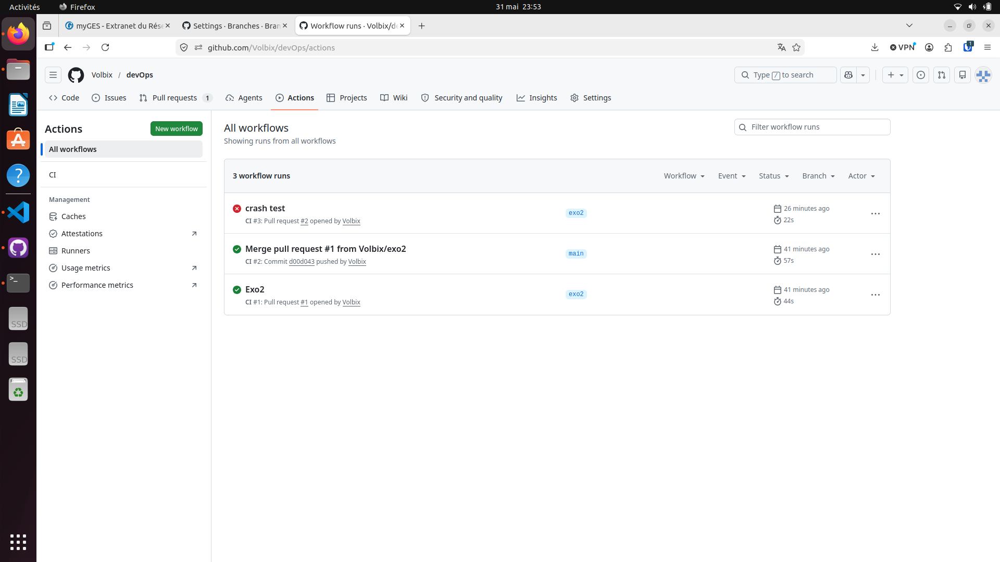
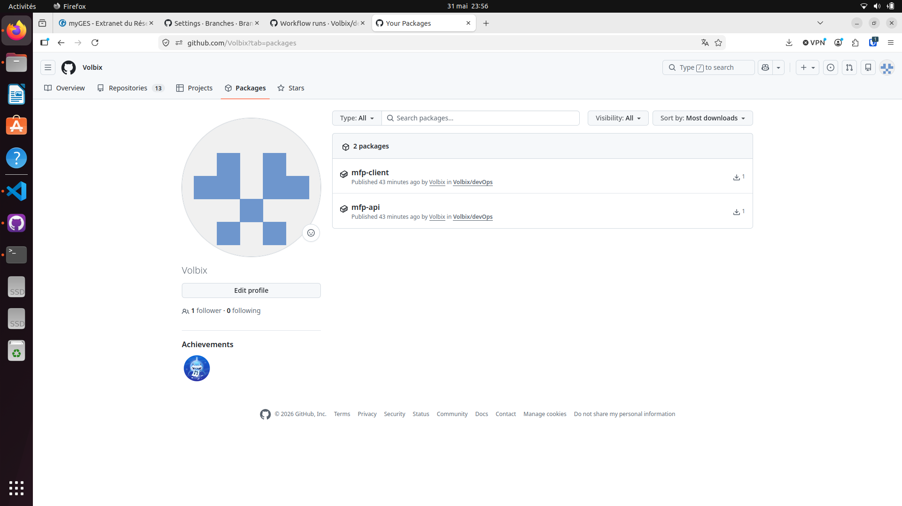
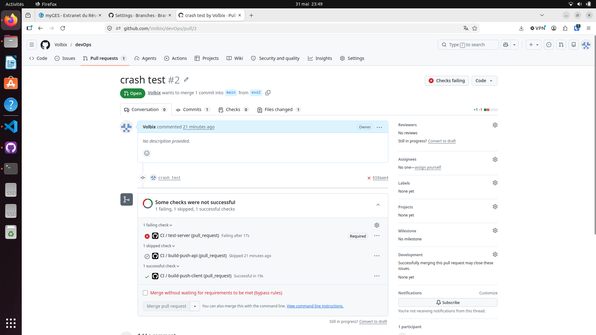

# My Favorite Places - Documentation DevOps

> Application Node.js + React + PostgreSQL containerisée avec CI/CD automatisé via GitHub Actions, Traefik et Shepherd.

---

## Documentation du système CI/CD

### Environnements d'exécution

| Environnement | Commande | Usage |
|---|---|---|
| **Local dev** (avec build) | `docker compose up --build` | Développement quotidien, ports directs (3000, 5173) |
| **Local prod-like** (images GHCR) | `docker compose -f compose.prod.yml up` | Reproduire la prod sans rebuilder |
| **Local avec Traefik + Portainer** | `docker compose -f compose.traefik.yml up -d` | Reverse proxy, CD automatique avec Shepherd |

### Flows CI/CD et leurs déclencheurs

```
Push / PR sur main ou master
        │
        ▼
┌─────────────────────────────────────────────┐
│               GitHub Actions CI              │
│                                             │
│  1. test-server  → npm test (Jest)          │
│     └─ si KO : bloque le merge de la PR    │
│                                             │
│  2. build-push-api  (dépend de test-server) │
│     └─ si push sur main : pousse           │
│        ghcr.io/volbix/mfp-api:latest        │
│                                             │
│  3. build-push-client  (indépendant)        │
│     └─ si push sur main : pousse           │
│        ghcr.io/volbix/mfp-client:latest     │
└─────────────────────────────────────────────┘
        │ (sur push main uniquement)
        ▼
┌─────────────────────────────────────────────┐
│                  Shepherd (CD)              │
│  - poll GHCR toutes les 1min               │
│  - si nouvelle image → redémarre le        │
│    container (label autoupdate_enabled)     │
└─────────────────────────────────────────────┘
```

### Effets de bord des flows

- **CI sur PR** : statut de check visible sur GitHub, merge bloqué si tests KO
- **CI sur push main** : nouvelles images publiées sur GHCR (`ghcr.io/volbix/mfp-*:latest`)
- **Shepherd** : redémarrage automatique des containers `api` et `client` dès qu'une nouvelle image est détectée

### Ce que le dev doit faire / surveiller

| Action dev | Effet automatique |
|---|---|
| Push sur une branche + PR | Tests lancés, merge bloqué si KO |
| Merge PR sur `main` | Images rebuiltées et poussées sur GHCR |
| Rien (Shepherd actif) | Containers redémarrés avec la nouvelle image sous 1min |
| Casser `getDistance.ts` | Tests échouent → merge impossible → pas de nouvelle image |

> **Attention** : toujours merger sur `main` via PR, jamais en direct (branch protection activée).

---

## Prérequis

- Docker + Docker Compose
- Node.js + npm/yarn (pour tests hors Docker)
- Bruno (pour tester l'API)

## 1) Prise en main du projet et test du serveur

### Lancer le serveur en local (hors Docker)

Dans `server` :

```bash
yarn dev
```

Par défaut, l'API écoute sur `http://localhost:3000`.

### Tester avec Bruno

Exemple de requête :

- `GET http://localhost:3000/api/users/me` (avec token si nécessaire)
- ou un endpoint public disponible dans le projet

## 2) Dockerisation du serveur

Le Dockerfile du serveur est présent dans `server/Dockerfile`.

Build + run :

```bash
docker build -t mfp-server ./server
docker run --rm -p 3000:3000 --network host mfp-server
```

Puis retest de l'API avec Bruno sur `http://localhost:3000`.

## 3) `compose.yml` à la racine (API + PostgreSQL)

Le fichier `compose.yml` à la racine lance :

- `db` : conteneur PostgreSQL (`postgres:17.3`)
- `api` : serveur Node/TypeScript
- `client` : front React servi par Nginx

Lancement :

```bash
docker compose up --build
```

## 4) Test et dockerisation du client React

Le Dockerfile du client est présent dans `client/Dockerfile`.

Avec compose :

- Front : `http://localhost:5173`
- API : `http://localhost:3000`

En conteneur, le front est buildé en statique puis servi par Nginx.

## 5) Réflexion : communication entre les services

### BDD <-> Serveur

- Le serveur utilise TypeORM + driver `pg` pour se connecter à PostgreSQL en TCP.
- Dans Docker Compose, le serveur contacte la base via le nom de service `db` (résolution DNS interne du réseau Docker).
- Variables utilisées côté API : `DB_HOST`, `DB_PORT`, `DB_USER`, `DB_PASSWORD`, `DB_NAME`.

### Serveur <-> Front

- Le navigateur charge le client React sur `localhost:5173`.
- Les appels API du front utilisent `/api/...`.
- En local (hors Docker), Vite proxy ces requêtes vers l'API (`http://localhost:3000`).
- En Docker Compose, Nginx proxy `/api` vers `http://api:3000` sur le réseau interne Docker.

## Pour aller plus loin - Réalisé

### 1) Démarrage API uniquement quand la BDD est prête

Dans `compose.yml` :

- ajout d'un `healthcheck` sur `db` avec `pg_isready`
- passage de `api.depends_on.db.condition` à `service_healthy`

Effet : le conteneur `api` ne démarre qu'une fois PostgreSQL déclarée "healthy".

### 2) Redémarrage automatique des services

Dans `compose.yml`, ajout de :

- `restart: unless-stopped` sur `db`
- `restart: unless-stopped` sur `api`
- `restart: unless-stopped` sur `client`

Effet : les services redémarrent après crash/reboot, sauf arrêt manuel.

### 3) Optimisation des images avec Docker build stages

#### Serveur (`server/Dockerfile`)

- passage en multi-stage : `deps` -> `builder` -> `runtime`
- build TypeScript dans le stage `builder`
- image finale runtime avec dépendances de production uniquement (`npm ci --omit=dev`)
- lancement en prod via `node dist/index.js`
- ajout de `server/.dockerignore` pour réduire le contexte de build

#### Client (`client/Dockerfile`)

- stage `builder` : build Vite (`npm run build`)
- stage `runtime` : image Nginx alpine légère
- copie des assets statiques dans `/usr/share/nginx/html`
- ajout d'un `client/nginx.conf` pour :
  - servir l'application React (fallback SPA vers `index.html`)
  - proxifier `/api` vers le service `api`
- ajout de `client/.dockerignore`

### Résultat attendu sur la taille des images

Le serveur n'embarque plus TypeScript, nodemon ni les dépendances de dev dans l'image finale, ce qui permet de réduire significativement la taille (objectif de l'ordre de ~100 Mo selon cache et couches locales).

## Vérifications rapides

```bash
docker compose config
docker compose up --build
```

Puis :

- Ouvrir le front sur `http://localhost:5173`
- Tester un endpoint API dans Bruno sur `http://localhost:3000`
- Vérifier dans les logs Docker que l'API se connecte bien à PostgreSQL

## Commandes utiles de vérification

```bash
docker compose ps
docker compose logs db
docker compose logs api
docker images | grep -E "my-favorite-places|server|client"
```

---

## 7) Traefik (reverse proxy) + Portainer

### Principe

Traefik est un reverse proxy natif Docker : chaque service se déclare lui-même via des **labels** Docker, sans configuration centralisée.

### Lancement

```bash
docker compose -f compose.traefik.yml up --build -d
```

### Entrées `/etc/hosts` à ajouter (une seule fois)

```bash
echo "127.0.0.1 mfp.localhost api.mfp.localhost traefik.mfp.localhost portainer.mfp.localhost" | sudo tee -a /etc/hosts
```

### Services accessibles

| URL | Service |
|-----|---------|
| `http://mfp.localhost` | Client React |
| `http://api.mfp.localhost` | API Node.js |
| `http://traefik.mfp.localhost/dashboard/` | Dashboard Traefik |
| `http://portainer.mfp.localhost` | Portainer |
| `http://localhost:8080` | Dashboard Traefik (direct) |

### Vérification des routes détectées par Traefik

```
$ curl -s http://localhost:8080/api/http/routers | python3 -m json.tool | grep '"name"'
"name": "api@docker"
"name": "client@docker"
"name": "portainer@docker"
"name": "traefik-dashboard@docker"
```

### Résultat `docker compose -f compose.traefik.yml ps`

```bash
docker compose -f compose.traefik.yml up -d && docker compose -f compose.traefik.yml ps
```



### Fonctionnement

- Plus de ports directs exposés sur `api` et `client` : tout passe par Traefik sur le port 80
- Traefik lit les labels Docker pour construire sa table de routage dynamiquement
- Portainer permet de visualiser et piloter les containers via une interface web

---

## 8) Déploiement Continu (CD) avec Shepherd

### Endpoint `GET /api/bonjour`

Ajout d'un endpoint de test dans `server/src/router.ts` :

```
GET http://api.mfp.localhost/api/bonjour
→ { "message": "Bonjour !" }
```

Après push sur `main`, la CI rebuild et pousse l'image `ghcr.io/volbix/mfp-api:latest` sur GHCR.

### Approche polling avec Shepherd

**Shepherd** vérifie toutes les minutes si de nouvelles images sont disponibles sur le registry et redémarre les containers concernés automatiquement.

Ajouté dans `compose.traefik.yml` :
- Service `shepherd` avec `SLEEP_TIME=1m` et `FILTER_SERVICES=label=autoupdate_enabled=true`
- Label `autoupdate_enabled=true` sur `api` et `client` pour opt-in au CD automatique

### Cycle CI/CD complet

```
1. Push code sur main
2. GitHub Actions → tests → build image → push ghcr.io/volbix/mfp-api:latest
3. Shepherd (toutes les 1min) → détecte nouvelle image → pull → redémarre le container
4. L'API est mise à jour sans intervention manuelle
```

### Test de la CD

```bash
# Lancer le stack avec Shepherd
docker compose -f compose.traefik.yml up -d

# Observer les logs Shepherd
docker compose -f compose.traefik.yml logs -f shepherd
```

Exemple de logs Shepherd (après détection d'une nouvelle image) :
```
shepherd    | Checking for updates for api
shepherd    | Updating service api with image ghcr.io/volbix/mfp-api:latest
shepherd    | Successfully updated api
```

---

## 6) Intégration continue (CI) avec GitHub Actions

### Structure

Le fichier `.github/workflows/ci.yml` déclenche la CI à chaque push ou PR sur `main`/`master`.

**Jobs :**
- `test-server` : installe les dépendances Node et exécute `npm test` (Jest)
- `build-push-api` : build l'image Docker du serveur et la pousse sur GHCR (uniquement sur push, pas PR)
- `build-push-client` : idem pour le client React



**Résultat des tests en local :**

```
> server@1.0.1 test
> jest

Test Suites: 1 passed, 1 total
Tests:       2 passed, 2 total
Snapshots:   0 total
Time:        0.167 s
```

### Images publiées sur GHCR

Après un push sur `main`, les images sont disponibles sur GitHub Container Registry :

```
ghcr.io/volbix/mfp-api:latest
ghcr.io/volbix/mfp-client:latest
```



### Exercice 3 — `compose.prod.yml`

Le fichier `compose.prod.yml` remplace les `build:` par des `image:` pointant vers GHCR :

```bash
docker compose -f compose.prod.yml up
```

Cela démarre les services en utilisant les images produites par la CI, sans recompiler localement.

### Protection de la branche `main`

Configuration dans GitHub > Settings > Branches > Branch protection rules :

- Interdire les push directs sur `main`
- Exiger que les tests CI passent avant de merger une PR

**Test de vérification :**  
Casser volontairement `getDistance.ts` sur une branche → créer une PR → la CI échoue → merge impossible.



### Pour aller plus loin — Path filtering

Le workflow ne rebuild que le service modifié en filtrant sur les chemins :

- Modifications dans `server/**` → déclenche `test-server` + `build-push-api`
- Modifications dans `client/**` → déclenche `build-push-client`
